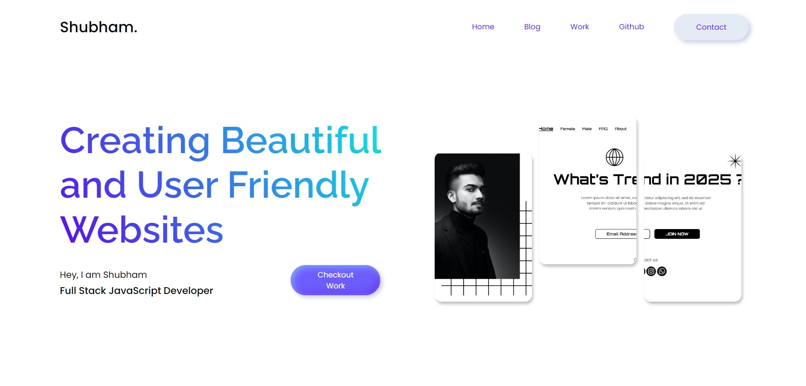

# My Portfolio | HTML  and CSS 

By **Shubham**

Here's the Live Deployed Website 

## [DEPLOYED WEBSITE LINK](https://shubhamvscode.netlify.app/)

## What I learned from this Project?

- I learned about **layout** making through **Flexbox & Grid**.
- I also learned how to make a full fledged website end to end.
- I also learned how to make **Beautiful Buttons**.
- I also learned how to make resuable Buttons.
- I also learned about making beautiful **Cards**.
- I also learned tackle svgs.

## This project took around **7 hours** to complete.
